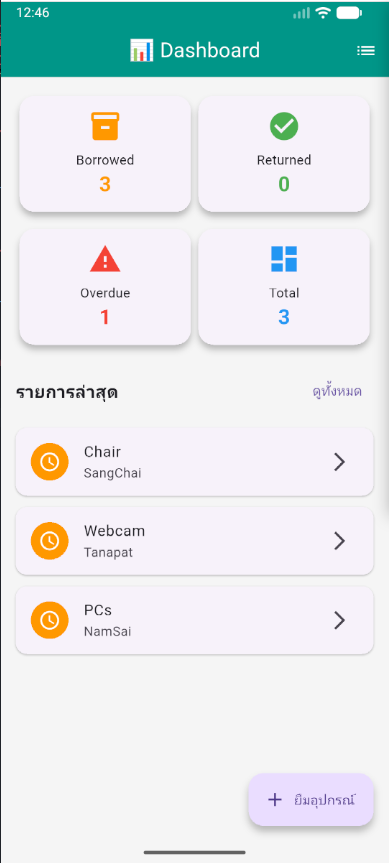
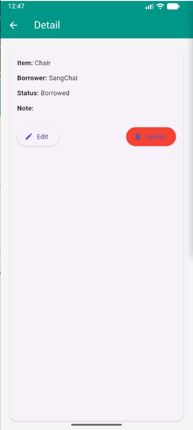
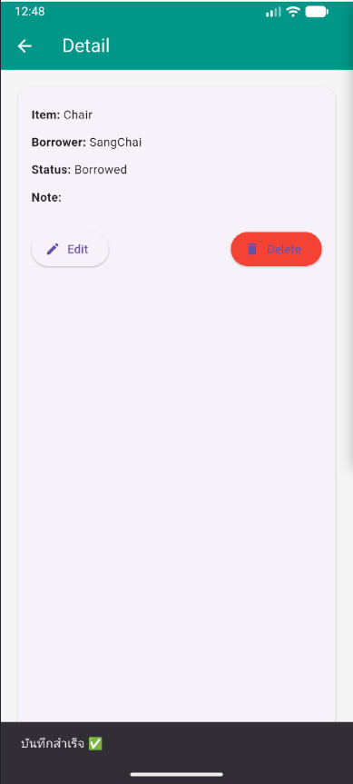
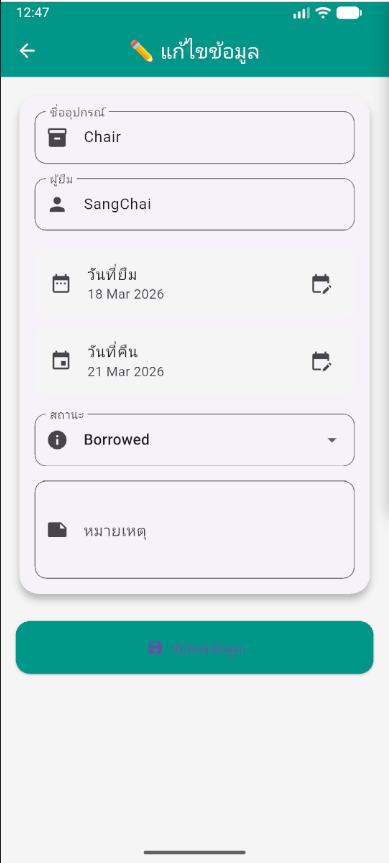
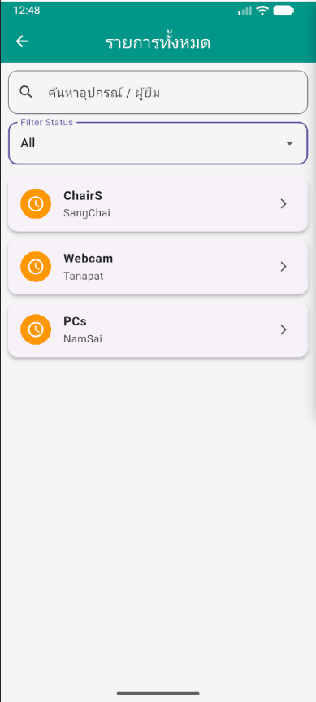
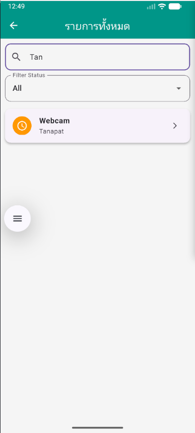
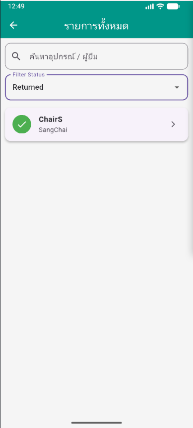

# 📦 ระบบบันทึกการยืม-คืนอุปกรณ์ (Borrow Equip App)

## 📝 ระบบจัดการการยืม-คืนอุปกรณ์ (Borrow & Return Equipment Management System)

---

## ผู้จัดทำ

- **ชื่อ**: ธนภัทร นุกูล
- **รหัสนักศึกษา**:67543210031-0

## 📌 รายละเอียดฟังก์ชัน

### 🔹 1. Dashboard

- แสดงสถิติภาพรวม:
  - จำนวนที่กำลังยืม (Borrowed)
  - จำนวนที่คืนแล้ว (Returned)
  - จำนวนเกินกำหนด (Overdue)
  - จำนวนทั้งหมด (Total)
- แสดงรายการล่าสุด (Recent List)

---

### 🔹 2. เพิ่มข้อมูล (Add Record)

- เพิ่มข้อมูลการยืม:
  - ชื่ออุปกรณ์
  - ผู้ยืม
  - วันที่ยืม
  - วันที่คืน
  - สถานะ (Borrowed / Returned)
  - หมายเหตุ

---

### 🔹 3. แก้ไขข้อมูล (Edit Record)

- แก้ไขข้อมูลเดิมได้ทั้งหมด
- อัปเดตสถานะการคืน

---

### 🔹 4. ลบข้อมูล (Delete Record)

- ลบรายการยืมได้

---

### 🔹 5. ค้นหา (Search)

- ค้นหาจาก:
  - ชื่ออุปกรณ์
  - ชื่อผู้ยืม

---

### 🔹 6. กรองข้อมูล (Filter)

- กรองตามสถานะ:
  - All
  - Borrowed
  - Returned

---

### 🔹 7. ตรวจสอบเกินกำหนด (Overdue)

- ตรวจสอบอัตโนมัติจาก:
  - วันที่คืน < วันปัจจุบัน
  - และสถานะยังไม่เป็น Returned

---

## 🗂️ โครงสร้างข้อมูล (Data Structure)

### 📦 ตาราง: borrow_records

| Field      | Type    | Description         |
| ---------- | ------- | ------------------- |
| id         | INTEGER | Primary Key         |
| itemName   | TEXT    | ชื่ออุปกรณ์         |
| borrower   | TEXT    | ผู้ยืม              |
| borrowDate | TEXT    | วันที่ยืม (ISO8601) |
| returnDate | TEXT    | วันที่คืน (ISO8601) |
| status     | TEXT    | Borrowed / Returned |
| note       | TEXT    | หมายเหตุ            |

---

## 🧩 ER Diagram

| BorrowRecord |
| ------------ |
| id (PK)      |
| itemName     |
| borrower     |
| borrowDate   |
| returnDate   |
| status       |
| note         |

---

## 📦 Packages ที่ใช้

| Package  | รายละเอียด               |
| -------- | ------------------------ |
| provider | จัดการ state ของแอป      |
| intl     | จัด format วันที่        |
| sqflite  | ฐานข้อมูล SQLite         |
| path     | จัดการ path ของ database |

---

## ⚙️ วิธีติดตั้งและรัน

### 🔹 1. Clone โปรเจกต์

```bash
    git clone https://github.com/your-username/your-repo.git
    cd your-repo
```

### 🔹2. ติดตั้ง dependencies

```bash
    flutter pub get
```

### 🔹3. รันแอป

```bash
    flutter pub run
```

## 📸 Screenshots

### 1️⃣ Home / Dashboard



---

### 2️⃣ Detail Screen



---

### 3️⃣ State Management (Notifier)



---

### 4️⃣ Edit Screen



---

### 5️⃣ List Screen



---

### 6️⃣ Search Feature



---

### 7️⃣ Filter Feature


